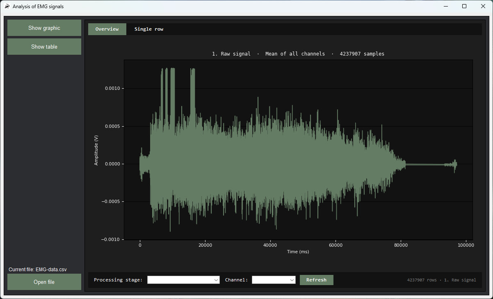
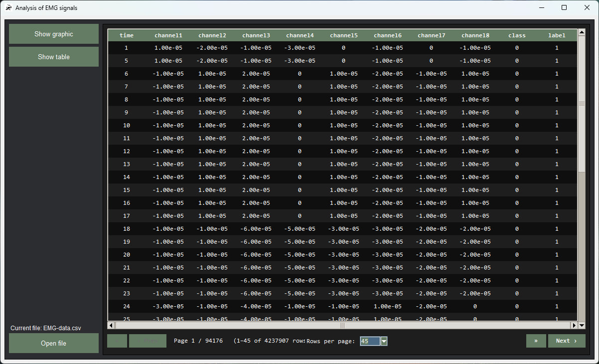
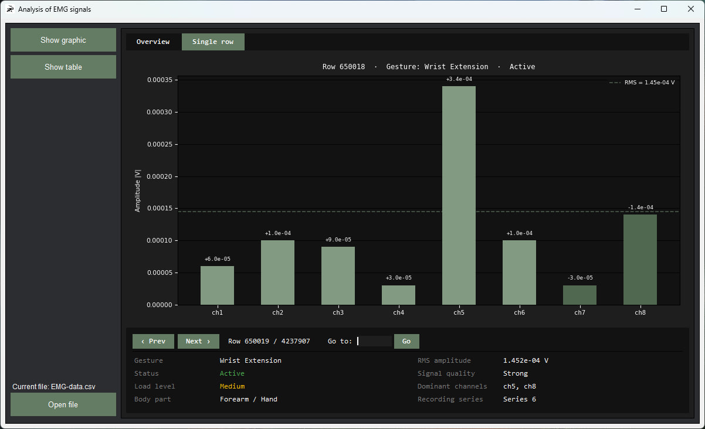
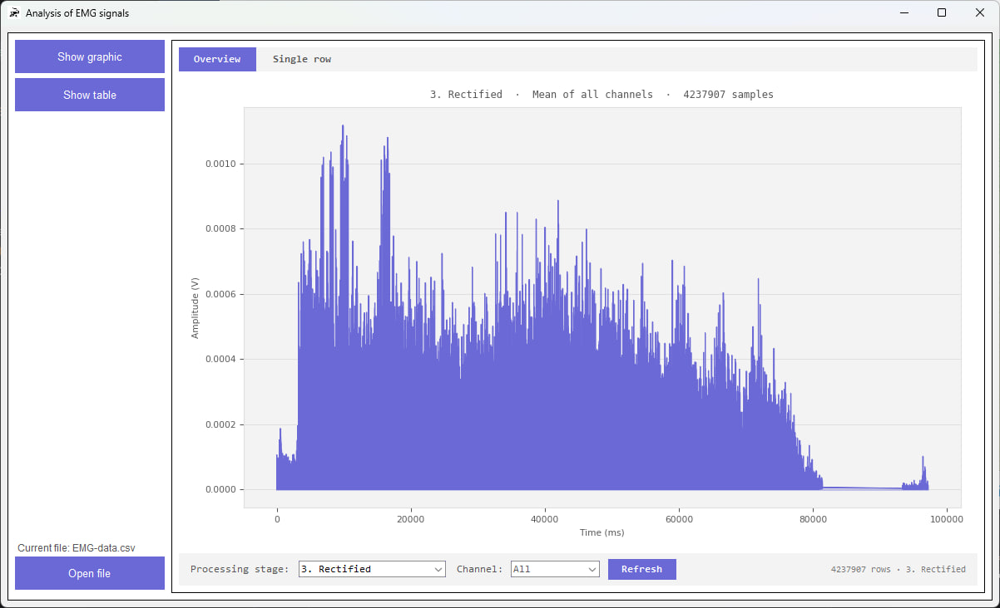

# 🧠 Analysis of EMG Signals

---

## 📋 Table of Contents

- [Overview](#overview)
- [Features](#features)
- [Screenshots](#screenshots)
- [Tech Stack](#tech-stack)
- [Project Structure](#project-structure)
- [Getting Started](#getting-started)
- [Data Format](#data-format)
- [Gesture Classes](#gesture-classes)
- [Signal Processing Pipeline](#signal-processing-pipeline)

---

## Overview

**Analysis of EMG Signals** is a Windows desktop application that lets you load, explore, and analyse EMG datasets in CSV format. It provides two interactive views — a **paginated data table** and a **signal chart viewer** — along with a full per-sample analysis engine that computes gesture classification, RMS amplitude, signal quality, and dominant channel detection.

The application was originally developed around the [EMG Signal for Gesture Recognition](https://www.kaggle.com/datasets/sojanprajapati/emg-signal-for-gesture-recognition) dataset from Kaggle, but it accepts any CSV file that follows the expected schema.

---

## Features

### 📂 File Management
- Open any `.csv` file via a native file dialog
- Automatic schema validation — the app checks column names, data types, and null values before loading
- Human-readable file summary shown on successful load (row count, column count, unique classes and labels)

### 📊 Table View
- Paginated display of the full dataset using a native `Treeview` widget
- Configurable page sizes (30 / 45 / 60 rows per page)
- Horizontal and vertical scrollbars
- Themed column headers matching the Windows accent color

### 📈 Signal View — Overview Tab
- Full dataset time-series plot for all 8 EMG channels
- **4-step signal processing pipeline** selectable via dropdown:
  1. Raw signal
  2. Bandpass-filtered (10–90 Hz Butterworth)
  3. Full-wave rectified
  4. Linear envelope (moving-average smoothed)
- Channel selector to isolate individual channels

### 🔬 Signal View — Single Row Tab
- Bar chart showing absolute channel amplitudes for any selected sample
- Inline analysis panel displaying:
  - Detected gesture name and class ID
  - Active / Passive status
  - Muscle load level (None / Low / Medium / High)
  - Body part (Forearm / Hand)
  - Recording series label
  - RMS amplitude
  - Signal quality (No signal / Weak / Normal / Strong)
  - Top 2 dominant channels
- Row navigation with Previous / Next buttons and a direct index input

### 🎨 Windows Theme Integration
- Reads the system accent color via the **WinRT** API at startup
- Full **dark mode** and **light mode** support — automatically adapts to the Windows color scheme
- All UI elements (buttons, table headers, charts) use the live accent color

### 📦 Standalone Executable
- Ships with a `build.py` script and a `.spec` file for **PyInstaller**
- Produces a single-folder `.exe` that bundles all assets (icon, dependencies)

---

## Screenshots

### Main Window


### Table View


### Single Row Analysis


### Colorful Theme Support


---

## Tech Stack

| Library | Purpose |
|---|---|
| `tkinter` / `ttk` | Main GUI framework — windows, widgets, layout |
| `matplotlib` | Signal charts and bar plots embedded in Tkinter |
| `pandas` | CSV loading, DataFrame management, schema validation |
| `numpy` | Signal processing arithmetic, RMS computation |
| `scipy` | Butterworth bandpass filter (`butter`, `filtfilt`) |
| `winrt` (`winrt-Windows.UI`, `winrt-Windows.UI.ViewManagement`) | Reading Windows accent and background colors via WinRT API |
| `pyinstaller` | Packaging the app into a standalone `.exe` |
| `logging` | Structured application-level logging |

---

## Project Structure

```
Analysis-of-EMG-signals/
├── main.py                     # Entry point — initialises logger and launches GUI
├── build.py                    # PyInstaller build helper script
├── Analysis of EMG signals.spec # PyInstaller spec file
├── requirements.txt            # Python dependencies
├── data/
│   └── program.ico             # Application icon
├── readme/                     # Screenshots used in this README
│   ├── main_screenshot.png
│   ├── tables_watch.png
│   ├── single_rows.png
│   └── colorful_supports.png
└── src/
    ├── GUI.py                  # Main window, layout, file dialog, view routing
    ├── signal_view.py          # Signal chart widget (Overview + Single tab)
    ├── table_view.py           # Paginated table widget
    ├── analysis_signal.py      # Per-sample EMG analysis engine
    ├── table_manager.py        # CSV loading and schema validation
    ├── storage.py              # Global state — file info and theme cache
    └── logger.py               # Logging configuration
```

---

## Getting Started

### Prerequisites

- **Windows 10 or 11**
- **Python 3.11+**

### Installation

```bash
# 1. Clone the repository
git clone https://github.com/teferdet/Analysis-of-EMG-signals.git
cd Analysis-of-EMG-signals

# 2. Install dependencies
pip install -r requirements.txt

# 3. Run the application
python main.py
```

### Building a Standalone Executable

```bash
python build.py
```

The output will be placed in the `dist/` folder as a self-contained directory.

---

## Data Format

The application expects a CSV file with **exactly** the following 11 columns:

| Column | Type | Description |
|---|---|---|
| `time` | integer | Timestamp in milliseconds |
| `channel1` – `channel8` | float | Raw EMG amplitude for each of the 8 MYO bracelet sensors |
| `class` | integer | Gesture label (0–7, see table below) |
| `label` | integer | Recording series number (1 or 2) |

**Source dataset:** [EMG Signal for Gesture Recognition — Kaggle / Sojanprajapati](https://www.kaggle.com/datasets/sojanprajapati/emg-signal-for-gesture-recognition)

---

## Gesture Classes

| Class | Gesture | Status | Muscle Load |
|---|---|---|---|
| `0` | Unmarked | Passive | None |
| `1` | Rest | Passive | None |
| `2` | Fist | Active | High |
| `3` | Wrist Flexion | Active | Medium |
| `4` | Wrist Extension | Active | Medium |
| `5` | Radial Deviation | Active | Low |
| `6` | Ulnar Deviation | Active | Low |
| `7` | Fingers Spread | Active | Medium |

---

## Signal Processing Pipeline

The **Overview** tab allows you to switch between four processing stages applied to each channel:

| Step | Name | Description |
|---|---|---|
| 1 | **Raw signal** | Unprocessed sensor data as recorded |
| 2 | **Filtered** | 4th-order Butterworth bandpass filter (10–90 Hz) removes DC offset and high-frequency noise |
| 3 | **Rectified** | Full-wave rectification — absolute value of the filtered signal |
| 4 | **Envelope** | Linear envelope computed via moving-average smoothing (50 ms window) of the rectified signal |
